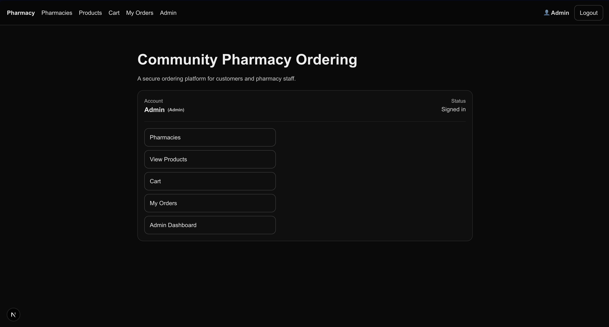

# PharmaTrack

A modern, serverless Pharmacy Management System built with React and Firebase. This application features real-time mapping, role-based access control, and full inventory management.

## Key Features
- **Interactive Pharmacy Map:** Uses Geolocation to visualize pharmacy branches and navigate to specific locations.
- **Role-Based Access Control (RBAC):** Distinct interfaces for Administrative management and standard User browsing.
- **Inventory Management:** Admins can manage medicine listings, stock levels, and prescription requirements.
- **Search Engine:** Dynamic search bar filtering by medicine name, road, or pharmacy branch.

## Tech Stack
- **Frontend:** React.js (Vite)
- **Backend/Database:** Firebase (Firestore & Authentication)
- **Mapping API:** [Insert Leaflet or Google Maps here]
- **Documentation:** Included Firestore rules and schema in the `/firebase-config` folder.

## Test Credentials
To explore the administrative and user features, use the following accounts:

| Role | Email | Password |
| :--- | :--- | :--- |
| **Admin** | `admin@pharm.com` | `admin123` |
| **User** | `user@pharm.com` | `user123` |

## Installation & Setup
1. **Clone the repo:** `git clone https://github.com/yurihenrique98/PharmaTrack.git`
2. **Install dependencies:** `npm install`
3. **Run the app:** `npm run dev`
