# PharmaTrack – Community Pharmacy Ordering Platform

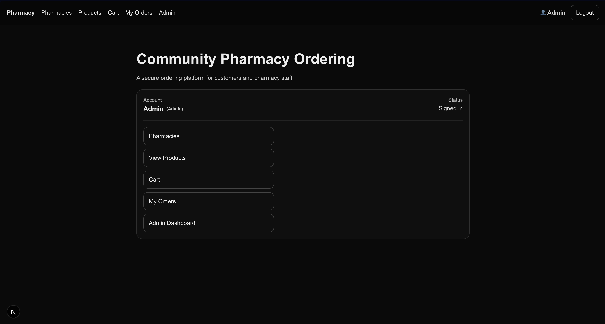

## Project Overview

PharmaTrack is a cloud-native pharmacy ordering platform developed using React and Firebase. The application enables customers to browse nearby pharmacies, search for medicines, reserve products, manage shopping carts, and place orders through an intuitive interface. Administrators are provided with comprehensive tools to manage products, inventory, customer accounts, and order processing.

Built using a serverless architecture, PharmaTrack leverages Firebase Authentication and Firestore to provide secure user management, real-time data synchronisation, and scalable cloud storage while integrating Leaflet and OpenStreetMap for interactive pharmacy location services.

---

# My Role

This was an individual university project where I independently designed, developed, tested, and documented the complete application, including frontend development, Firebase integration, authentication, database structure, and administrative functionality.

---

# Core Features

- Cloud-native pharmacy ordering platform
- Interactive pharmacy map using Leaflet
- Real-time medicine availability
- Pharmacy-specific product catalogue
- Shopping cart with stock reservation
- Secure checkout workflow
- Firebase Authentication
- Role-Based Access Control (RBAC)
- Product and inventory management
- Order management dashboard
- User account administration
- Real-time profile synchronisation
- Responsive user interface

---

# Technologies & Tools

## Frontend

- React
- Next.js
- TypeScript
- HTML5
- CSS3

## Backend & Cloud Services

- Firebase Authentication
- Firebase Firestore
- Firebase Hosting

## Database

- Cloud Firestore (NoSQL)

## APIs & Libraries

- Leaflet
- OpenStreetMap
- Firebase SDK

## Development Tools

- Visual Studio Code
- Git
- GitHub
- Postman

---

# Key Features

- Secure user authentication
- Role-based access control
- Interactive pharmacy map
- Pharmacy-specific stock filtering
- Shopping cart and reservation system
- Real-time stock updates
- Inventory management
- User management
- Order management
- Cloud database integration
- Responsive design
- Real-time Firestore synchronisation

---

# Application Showcase

## Home Page

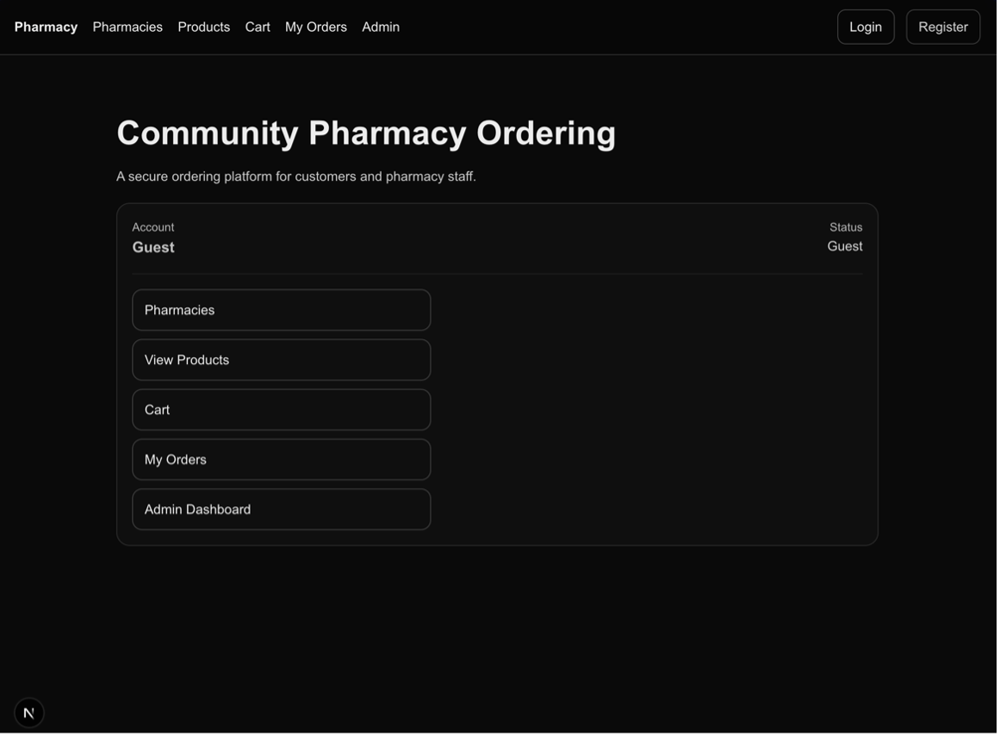

The homepage provides users with quick access to pharmacy locations, authentication, account management, and navigation throughout the application.

---

## Interactive Pharmacy Map

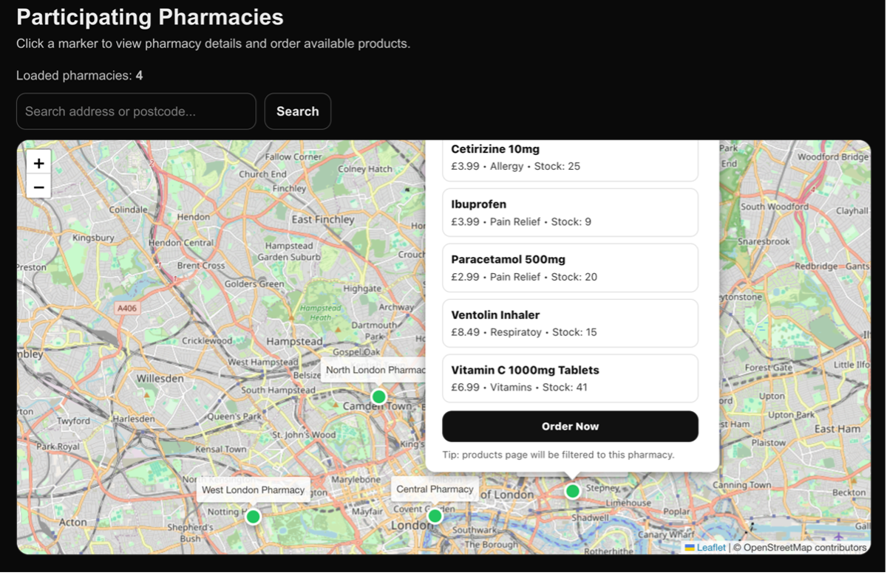

Users can browse pharmacy locations using an interactive Leaflet map integrated with OpenStreetMap. Selecting a pharmacy dynamically loads only the medicines available at that specific branch, improving both performance and user experience.

---

## Product Catalogue

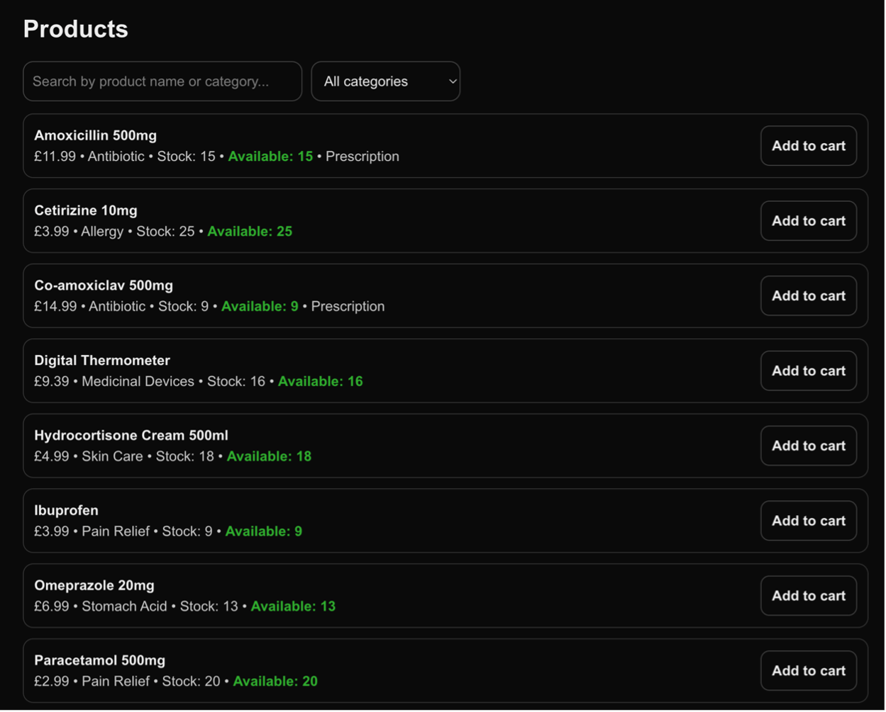

Products are filtered according to the selected pharmacy, allowing users to browse available medicines, review stock levels, and add items to their shopping cart.

---

## Shopping Cart & Checkout

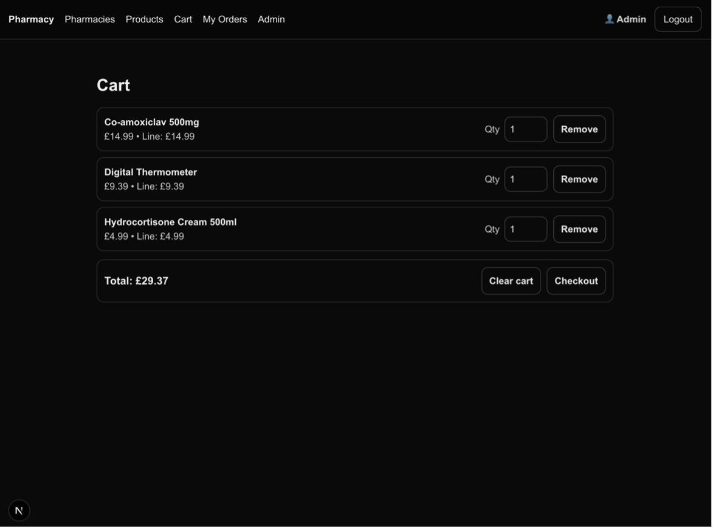
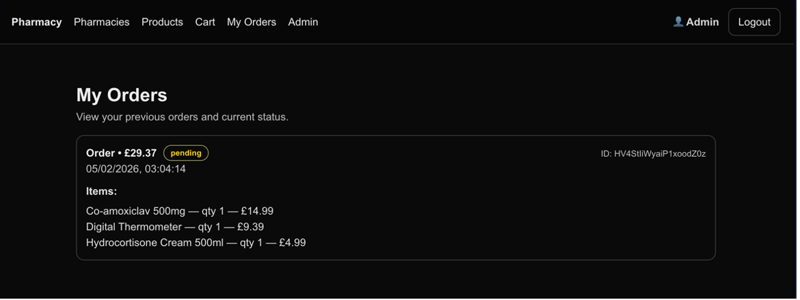

The reservation system temporarily reserves medicine stock while products remain in the user's shopping cart, reducing the possibility of conflicting purchases during checkout.

---

## Administrator Dashboard

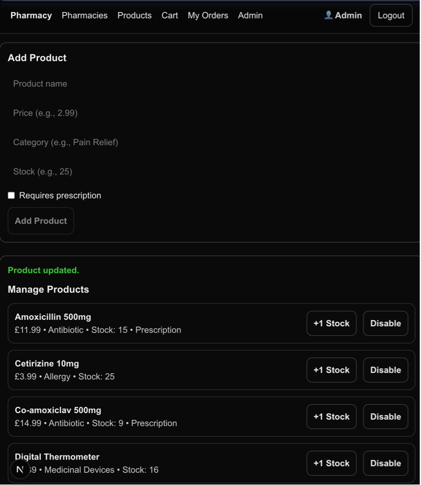
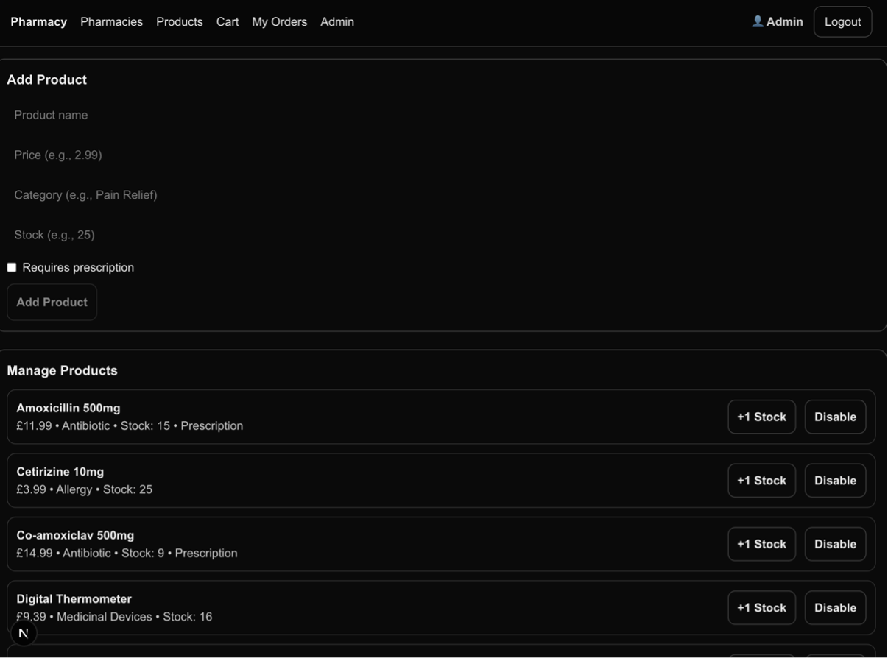
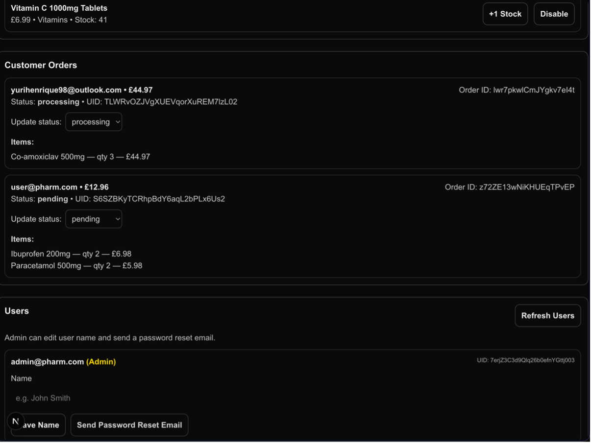

Administrators can:

- Add new medicines
- Update product information
- Manage stock levels
- Process customer orders
- Manage user accounts
- Disable user accounts when necessary

---

## User Profile Management

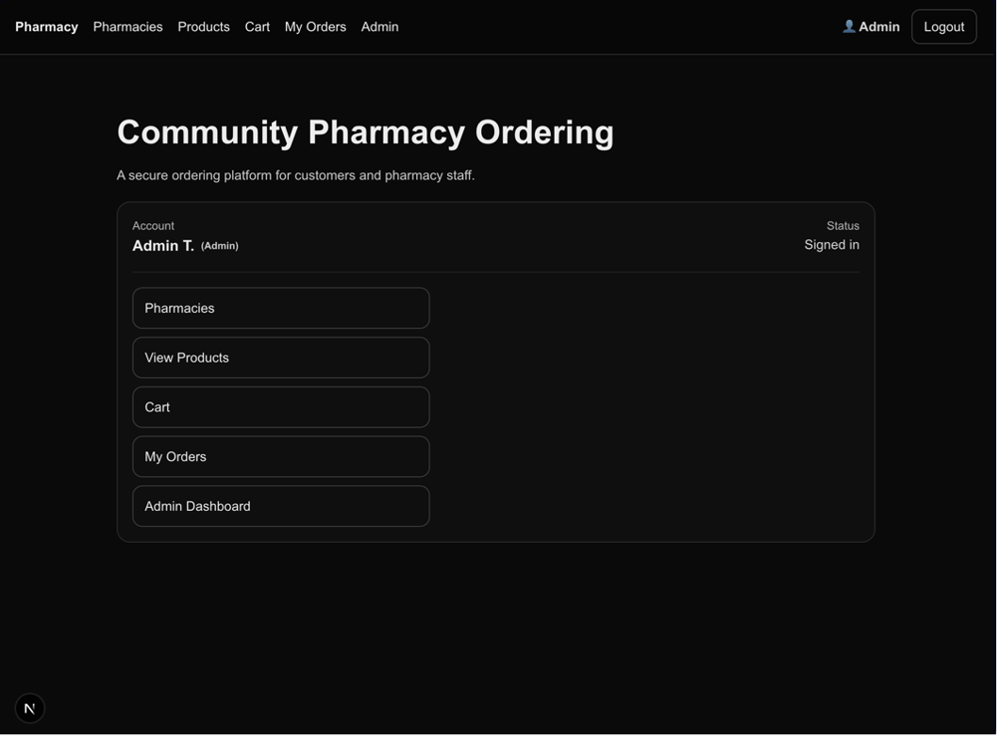
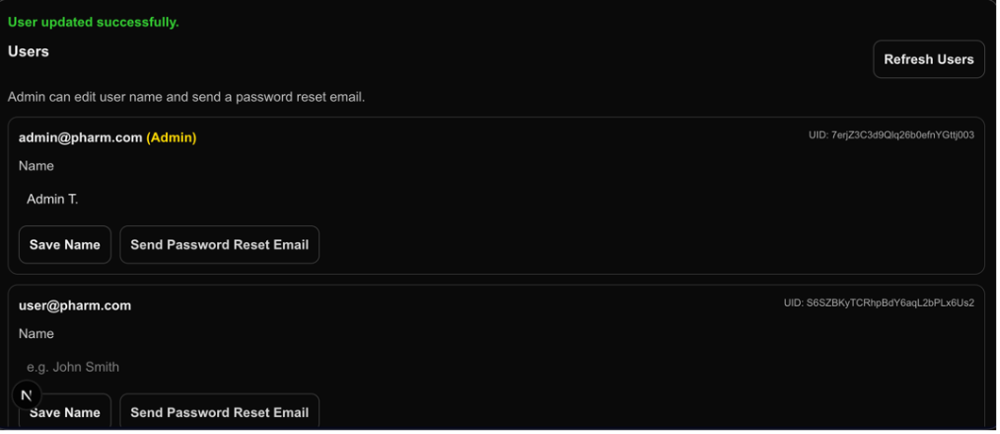


User profile information is synchronised in real time using Firestore snapshot listeners, ensuring interface updates occur immediately without requiring page refreshes.

---

# Cloud Architecture

PharmaTrack follows a serverless cloud architecture powered entirely by Firebase services.

The application combines:

- React client application
- Firebase Authentication
- Cloud Firestore database
- Cloud-hosted user data
- Real-time database listeners

This architecture removes the need for a traditional backend server while providing scalable infrastructure and real-time synchronisation.

---

# Firebase Integration

Firebase services are used throughout the application to provide secure authentication and cloud-based data storage.

Firestore stores:

- Users
- Pharmacies
- Products
- Orders
- Reservations

This flexible NoSQL structure allows the application to scale efficiently while maintaining fast query performance.

---

# Role-Based Access Control

Authentication is managed using Firebase Authentication while user roles are stored within Firestore.

Two user roles are supported:

### Customer

- Browse pharmacies
- Search medicines
- Manage shopping cart
- Place orders
- View order history

### Administrator

- Manage medicines
- Update stock
- Process orders
- Manage users
- Disable suspicious accounts

This separation ensures administrative functionality remains secure while customers can safely access public features.

---

# Interactive Pharmacy Map

Leaflet and OpenStreetMap provide an interactive mapping experience that allows users to locate nearby pharmacies.

Rather than loading every medicine available across the system, each pharmacy marker retrieves only the products assigned to that location, improving:

- Performance
- Accuracy
- Security

---

# Shopping Cart & Reservation System

The shopping cart includes a reservation mechanism that temporarily holds product stock while users complete the checkout process.

This helps prevent multiple customers from purchasing unavailable medicine simultaneously and demonstrates handling of real-time inventory management.

---

# Real-Time Synchronisation

Firestore snapshot listeners allow the application to immediately update interface components whenever data changes.

Real-time synchronisation is used for:

- User profile updates
- Order status
- Product stock
- Administrative changes

This eliminates the need for manual page refreshes and provides a modern user experience.

---

# Challenges & Solutions

During development several technical challenges were encountered and resolved.

### Firestore Permissions

Configured Firestore security rules to separate public product access from protected customer and administrator operations.

### Leaflet Rendering

Resolved React rendering conflicts by properly managing Leaflet component lifecycle.

### Administrator Roles

Implemented real-time user listeners to ensure administrator permissions remain synchronised.

### Product Loading

Normalised pharmacy product identifiers to guarantee accurate stock information across pharmacy locations.

---

# What I Learned

Developing PharmaTrack significantly strengthened my understanding of modern cloud application development.

Key learning outcomes include:

- React component architecture
- Next.js application development
- TypeScript
- Firebase Authentication
- Cloud Firestore
- NoSQL database design
- Real-time database synchronisation
- Role-Based Access Control
- Leaflet mapping integration
- Cloud application security
- State management
- Responsive user interface development

---

# Future Improvements

Future development could include:

- Payment gateway integration
- Firebase Admin SDK backend
- Advanced analytics dashboard
- Push notifications
- Prescription verification workflow
- Order tracking notifications
- Pharmacy reporting dashboard
- Accessibility improvements

---

# Test Credentials

Use the following accounts to explore both user roles.

| Role | Email | Password |
|------|--------|----------|
| **Administrator** | `admin@pharm.com` | `admin123` |
| **Customer** | `user@pharm.com` | `user123` |

---

# Installation & Setup

## Clone the Repository

```bash
git clone https://github.com/yurihenrique98/PharmaTrack.git

cd PharmaTrack
```

---

## Install Dependencies

```bash
npm install
```

---

## Configure Firebase

Create a `.env.local` file and add your Firebase configuration:

```env
NEXT_PUBLIC_FIREBASE_API_KEY=
NEXT_PUBLIC_FIREBASE_AUTH_DOMAIN=
NEXT_PUBLIC_FIREBASE_PROJECT_ID=
NEXT_PUBLIC_FIREBASE_STORAGE_BUCKET=
NEXT_PUBLIC_FIREBASE_MESSAGING_SENDER_ID=
NEXT_PUBLIC_FIREBASE_APP_ID=
```

---

## Start the Development Server

```bash
npm run dev
```

The application will be available at:

```
http://localhost:3000
```

---

# Conclusion

PharmaTrack demonstrates my ability to design and develop a modern cloud-native web application using React, Next.js, Firebase, and Firestore. The project combines secure authentication, role-based access control, real-time cloud data synchronisation, interactive mapping, inventory management, and responsive user interface design to deliver a scalable pharmacy ordering platform built using contemporary software engineering practices.
